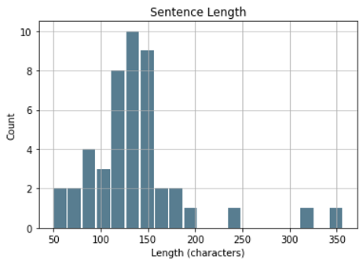
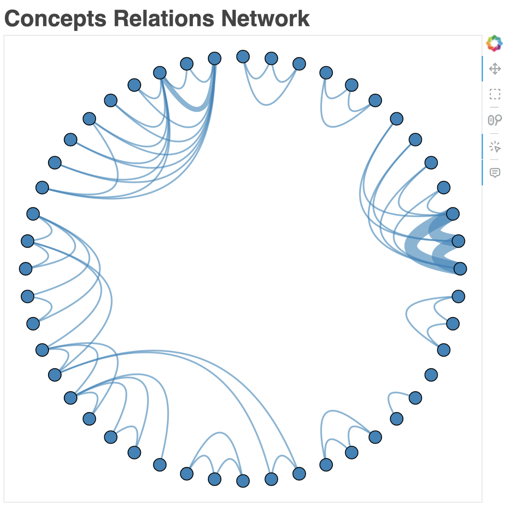
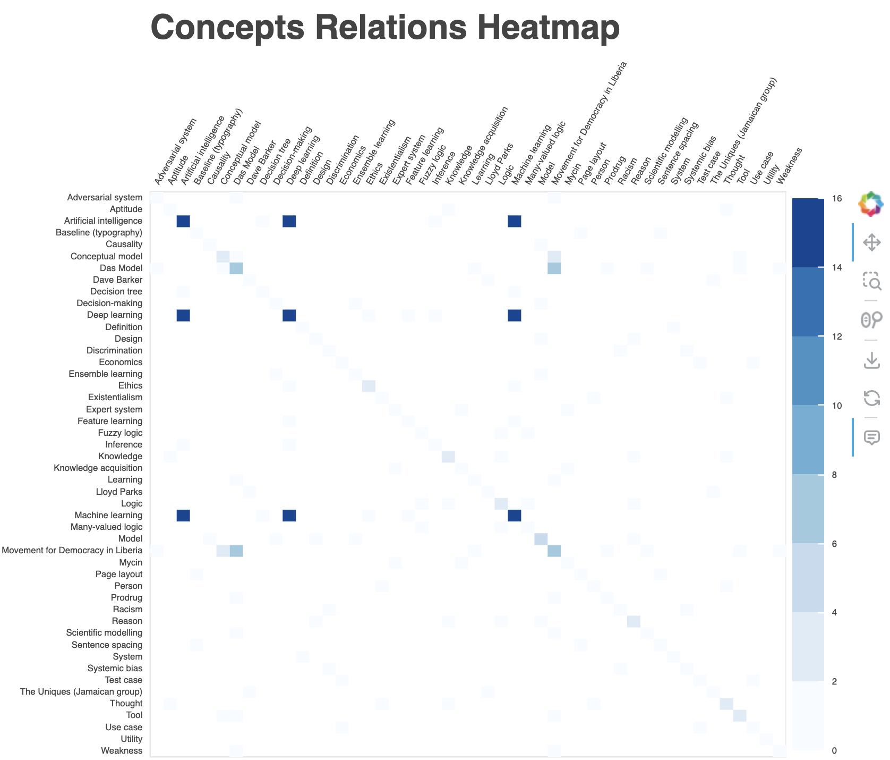
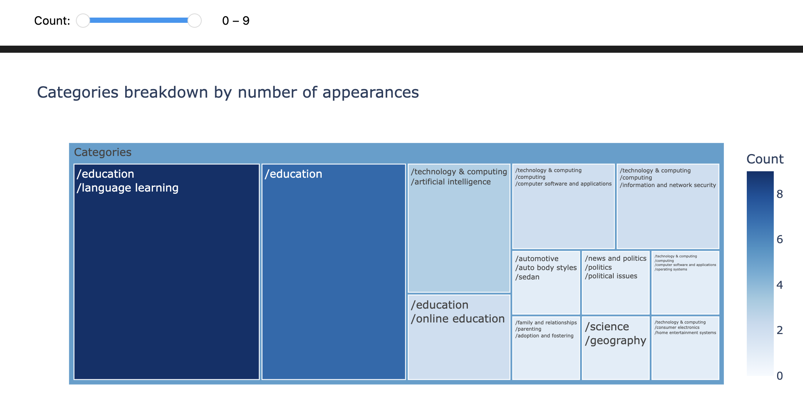
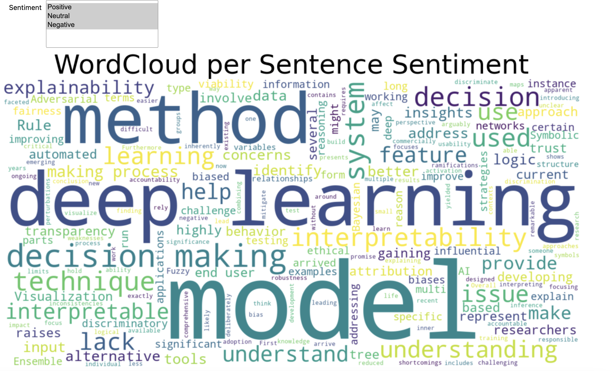
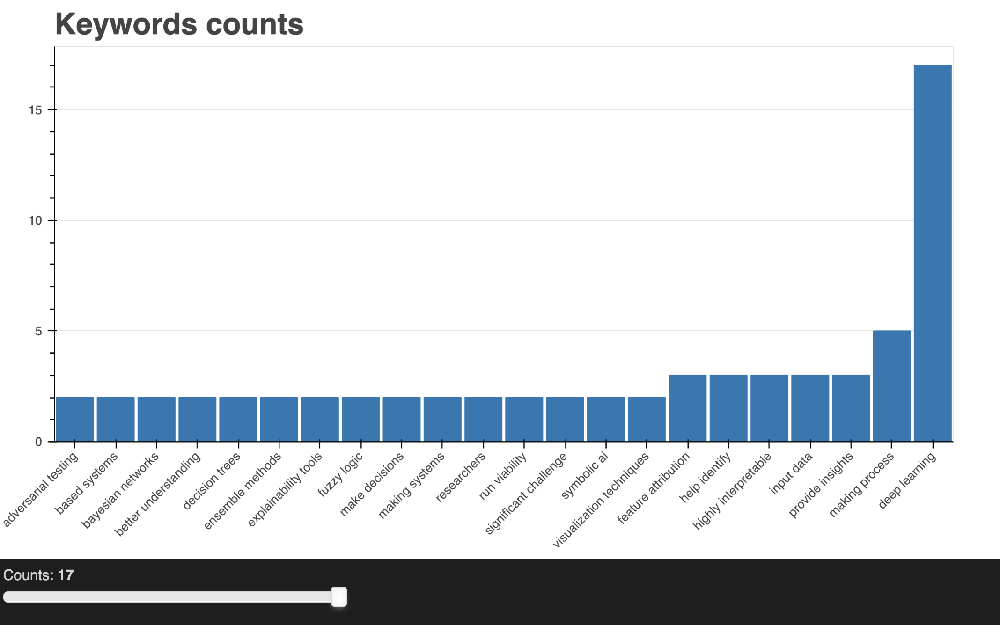

# NLP Interactive Visualizations using Python.
> You can find the notebook [visualizations.ipynb](visualizations.ipynb) used to generate the visualizations and the notebook [text_analysis.ipynb](text_analysis.ipynb) used to extract the NLP elements.

## Introduction

Developing data visualizations using libraries for Python, R, and JavaScript has been increasingly popular over the past years. Many of these tools have been released as open-source software, expanding their use among visualization developers. This project focuses on the creation of interactive visualization using Python. The five visualizations given in this work were created using Matplotlib, ipywidgets, Plotly, and Bokeh, four of the many available Python data visualization packages. Implementing several libraries allowed for a comparison of the strengths and weaknesses of these libraries.

The project's goal is to visually represent text analytics. The text used is a chatGPT conversation concerning deep learning's ethical issues. Deep learning is now being used in several commercially available products because of some impressive results it has produced recently. Nonetheless, it may be argued that one drawback of current deep learning methodologies is the lack of clarity regarding what exactly these techniques are learning. What is the significance of this current lack of understanding? What are the ethical ramifications of this issue? How might this affect the long-run viability of the techniques that are emerging? What approaches can be thought to deal with the problem and improve our comprehension of what these models are learning? What alternative deep methods might be able to address these concerns?

Although the focus of the project is not to develop NLP models, several strategies were implemented using both open-source and commercially available solutions like NLTK and IBM Watson. Some of the techniques implemented were sentence tokenization, keyword extraction, concepts, categories, and sentiment classification.

## Analysis

The text analysis proposed started by tokenizing the conversation into its sentences. The conversation has 939 words and was divided into 46 sentences. This technique was implemented through the library NLTK.

All the following analyses were performed on each sentence separately. The concepts classification returns high-level concepts in the content. For example, a sentence about deep learning might return the concept, "Artificial Intelligence" although the term is not mentioned. This technique was implemented using the IBM pre-trained model in their Natural Language Understanding API The top 3 concepts were extracted per each sentence and then only those with a relevance of 0.5 were considered. The 48 concepts extracted then were paired as several concepts co-exist in the same sentence. The idea was to build relationships between concepts that appear in the same sentence.

The categories classification returns a hierarchical taxonomy of the content. For example, a news website may return categories like ‘/international news’ or ‘/arts and entertainment’. This technique was implemented using the IBM pre-trained model in their Natural Language Understanding API. This model uses the IAB Tech Lab 2.0 taxonomy (iab Tech Lab, 2017). The top 3 categories were extracted per each sentence and then only those with a relevance of 0.9 were considered. In total, 12 categories were extracted and tallied how many times they appear in the sentences.

The sentiment classification returns a value between -1 and 1. The higher the score, the more positive the sentiment of the sentence. This technique was implemented using the IBM pre-trained model in their Natural Language Understanding API. A sentence can be considered positive if the score is positive, neutral if the score is 0, and negative if the score is negative. In total, there were 3 negatives, 19 neutral, and 24 positive sentences.

Keywords extraction was achieved using the Rapid Automatic Keyword Extraction algorithm implemented through the library NLTK (Sharma, 2018). After extracting the keywords or key phrases, they were merged by similarity. For instance, ‘Deep Learning’ and ‘Deep learning model’ were merged into ‘Deep Learning’. The keywords were counted to tally how many times they appear in the sentences of the conversation. Finally, only the keywords with more than one appearance were reported in the visualization. In total, 22 keywords were reported in Figure 6.

## Visualization of Text Analysis
This section describes the visualizations developed and the justification for their design.

### Concept Relations Network

Figure 2 shows a visualization proposed to understand the relationship between concepts and how often they appear in the conversation. The chart is a network graph on a circular layout displaying each node as one of the 48 concepts. The width of the edges of the graph is mapping the count of appearances of the relationship between concepts. The user can hover over the nodes to highlight the edges connected to that node in addition to the name of the concept. The user can also select the node to lock down the highlight of the connections. In addition, other tools were added to the graph, like zooming, and panning. This visualization was implemented using Networkx and Bokeh.

This visualization is relevant to understand first what concepts are being discussed in the sentences as well as how they are related. Outliers are easily spotted on both spectrums, for example, the relations between deep learning, machine learning, and artificial intelligence are easily spotted due to the width of the edges. As well as the fact that there is a concept without relation to other concepts. The graph shape helps human perception to create mental images of language concepts, establishing a base of understanding of the concepts being discussed.

### Concept Relations Heatmap

Figure 3 shows a heatmap chart to show the relationship between concepts and how often they appear in the conversation. The visualization has 48 concepts on the x-axis and y-axis. The color of the table cell maps the number of co-appearances of the concepts. The darker the color means that both concepts appear more often in the sentences. The user can hover over the cells to show a tooltip with the name of the related concepts and the count of appearances. In addition, other tools were added to the graph, like zooming, and panning. This visualization was implemented using Bokeh.

This visualization is relevant to understand first what concepts are being discussed in the sentences as well as how they are related. Compared to the network graph in Figure 2, the user has available the scale to understand how many appearances the two concepts have. Heavily tied concepts are easily spotted, for example, the relations between deep learning, machine learning, and artificial intelligence are easily spotted due to the width of the edges. The diagonal of the matrix gives an understanding of how many times each individual concept appears in the sentences.

### Categories breakdown by number of appearances

Figure 4 shows a Treemap used to display the breakdown of categories. The purpose of the analysis is to understand and compare the categories present in the sentences of the conversation. Users can hover over a node to get details on the number of appearances and count of appearances. In addition, the user can use a range slider to filter the nodes depending on the count. The Treemap was implemented using Plotly and the slider using ipywidgets.

A Treemap is a great tool for comparing quantity and understanding hierarchical data. The order directs the user’s attention to read from left to right the information required. The tree nature helps to understand the hierarchies of categories involved in the conversation.

### Word Cloud filtered by Sentence Sentiment

Figure 5 uses a Word Cloud to display word frequency in the conversation. This is one of the most common yet powerful visualizations for text analysis. The user can also filter the sentences used to calculate the word frequency through a multiple-select widget. As the user selects between any combination of positive, neutral, and negative the word cloud will update to reflect the word frequency. This visualization was implemented using Matplotlib and ipywidgets.

Word frequency is usually an important analysis used in text analytics. Word cloud provides an easy-to-understand and comparable method to display word frequency. For example, negative sentences seem to discuss decision-making while positive sentences focus on models, deep and learning.

### Keyword count bar chart

Figure 6 shows a bar chart with the keyword frequency found in the sentences. The user can hover over the bars to get the exact information of the frequency count for the keyword. In addition, the user can use the slider to filter all the keywords, showing only those with less than or equal to the slider value. This visualization was implemented using Bokeh.

## Conclusion

Text analysis requires a different set of visualizations to convey relations, flows, clustering, and similarity. Graphs and trees are great to display complex ideas in a text. Although the content of the visualizations developed in this project is dependent on the quality of the NLP models, the visualizations have the necessary framework for an understanding of the conversation facets.

Developing interactive visualizations using open-source libraries offer customization and a variety of visualizations. As several of these libraries were used for this project, some of their advantages were made evident. For example, Bokeh visualizations are easy to implement and come with a variety of tools and widgets for interaction. In addition, bokeh interaction can be executed offline as well as online. However, the interaction must be explicitly programmed using JavaScript. On the other hand, ipywidget works only while executing the notebook, and the widgets are not integrated into the visualization. However, it is easy to implement in almost every other library. Plotly is perhaps the most complete library, having a great balance of pre-built assets as well as customization for interaction.

## References

* Bokeh. (2023). User guide. Retrieved from bokeh: https://docs.bokeh.org/en/latest/docs/user_guide.html iab Tech Lab. (2017, November). Content Taxonomy. Retrieved from iab Tech Lab: https://iabtechlab.com/standards/content-taxonomy/

* IBM. (2022, March). Natural Language Understanding. Retrieved from IBM Cloud Docs: https://cloud.ibm.com/docs/natural-language-understanding?topic=natural-language-understanding-getting-started

* Sharma, V. B. (2018). rake-nltk. Retrieved from rake-nltk: https://csurfer.github.io/rake-nltk/_build/html/index.html
